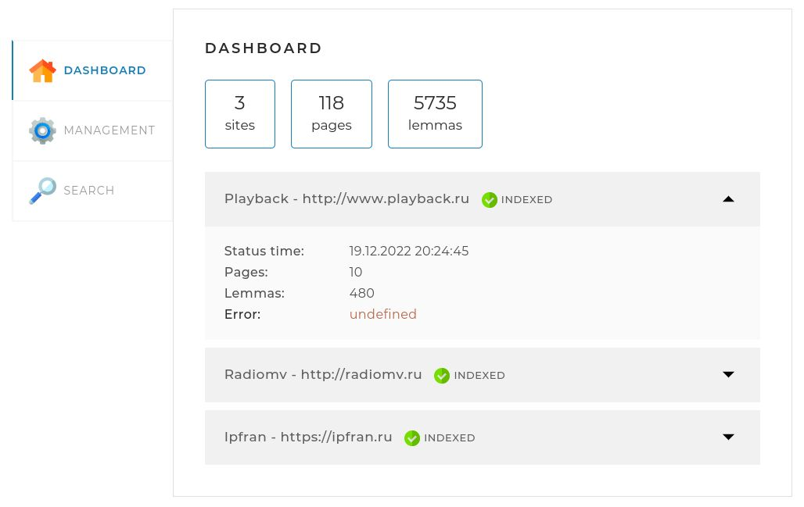
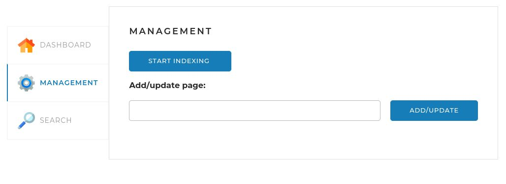
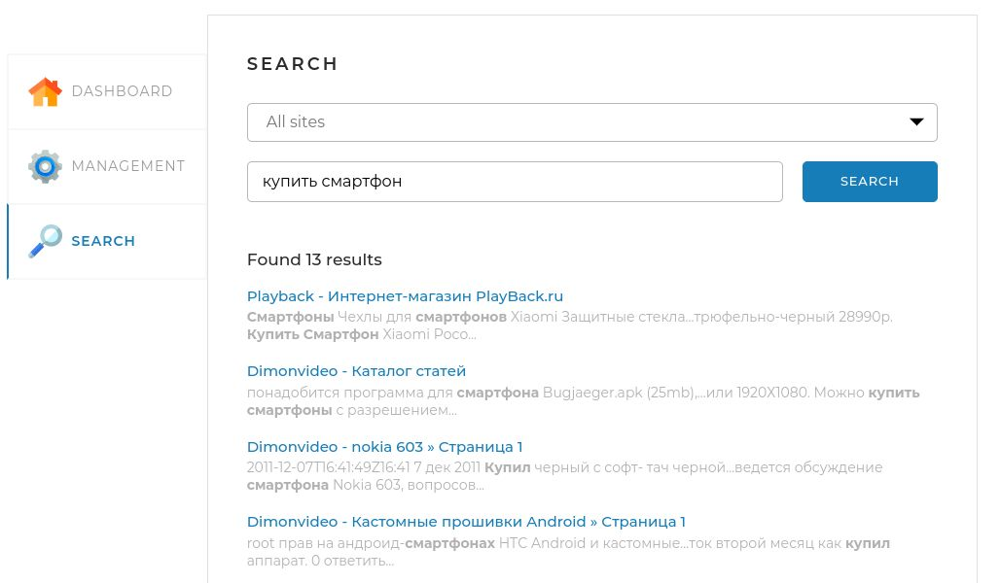

# Search engine app

---
### Application description

---
This project is a simple web application that provides you
API for searching text across websites or individual pages.
The web interface of the project is a single web page with three tabs:

* ***Dashboard.*** This tab opens by default (http://localhost:8080/). 
It displays general statistics for all sites, 
as well as detailed statistics and status for each of the sites:

* ***Management.*** This tab contains search engine management tools - 
starting and stopping full indexing (re-indexing), 
as well as the ability to add (update) a separate page using the link:

>**Note** that in order to index a separate page, 
> you need to specify the site data (address and name) in your 
> application.properties file

* ***Search.*** This page contains a search field, 
a drop-down list with a choice of a site for search, 
and when you click on the "Search" button, search results are displayed

---
### Launch application

---
* Install MySQL as working database;
* Download from project root self-executable SearchEngineApp-0.0.1-SNAPSHOT.jar;
* Create application.properties or application.yml
with your settings in same directory as SearchEngineApp-0.0.1-SNAPSHOT.jar;
* Put in application.yml your list of sites and 
if you want user agent name. You can also specify an upper bound on your query results (by default it's 200).
For example:

      sites:
       -
        url: http://www.playback.ru
        name: Playback
       -
        url: http://radiomv.ru
        name: Radiomv
      user-agent-name: Search_Engine_App
      result-page-max-count: 150

* Run application `java -jar SearchEngineApp-0.0.1-SNAPSHOT.jar`.

